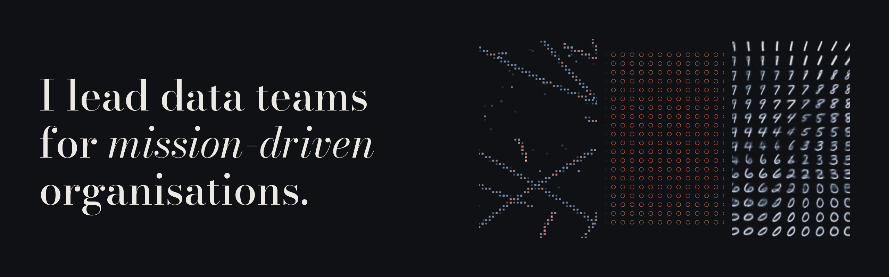

Data Team Lead at Hockeystick, a political tech start-up. Previously at the Democratic National Committee for the 2024 presidential election.

## Selected Work

**[How Many Samples Prove Mars Is Lifeless?](https://www.nature.com/articles/s41550-024-02443-0)** 
Nature Astronomy, 2024. Why demonstrating that a Martian environment is lifeless takes hundreds of samples.

**[Multi-Task Sentence Transformer](https://github.com/olivia-jackson-lambert/sentence-project)** 
One BGE-M3 backbone classifying receipt lines and tagging the entities inside them.

**[High Energy Particle CNN Classifier](https://github.com/olivia-jackson-lambert/high-energy-particle-classifier)** 
Identifying particles from liquid argon detector images.

**[Muon Momentum Regression](https://github.com/olivia-jackson-lambert/muon-momentum-regression-model)** 
Predicting muon track momentum resolution; R² of 0.854 against 0.698 for linear regression.

**[MNIST Variational Autoencoder](https://github.com/olivia-jackson-lambert/digit-variational-autoencoder)** 
Digit clusters form in a two-dimensional latent space without the model seeing a label.

## Writing

**[MLOps: The Bridge Between Research and Production](https://oliviajacksonlambert.com/writing/posts/mlops-future-data-science)** 
Why operational discipline now decides which organisations benefit from AI.

## Toolkit

Python · SQL · dbt · Spark · PyTorch · TensorFlow · scikit-learn · BigQuery · Snowflake · AWS · GCP

Case studies and full write-ups at [oliviajacksonlambert.com](https://oliviajacksonlambert.com).
